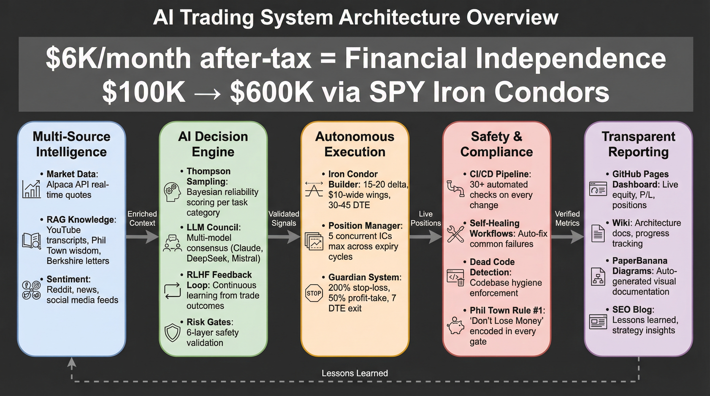
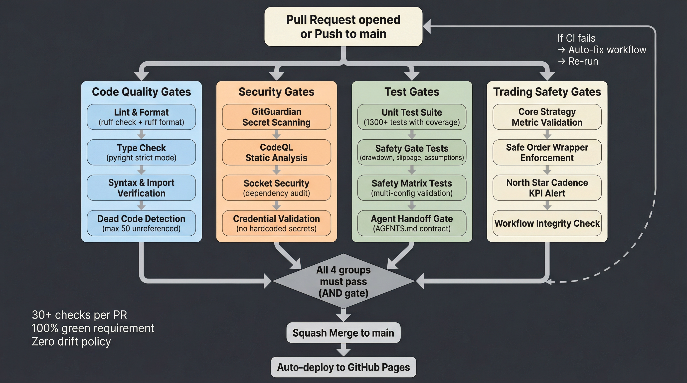

# Trading System

[](https://github.com/IgorGanapolsky/trading/actions/workflows/ci.yml)
[](pyproject.toml)
[](LICENSE)

This repository runs a paper-traded SPY options system. It is not a validated autonomous income machine, and it should not be described that way.

## Current Reality

As of **March 21, 2026**:

- Paper equity: **$99,600.93** vs. **$100,000.00** starting balance
- Canonical closed-trade sample: **1** closed iron condor for **+$41.00** realized P/L
- Current open book is not a clean production short-premium iron-condor book
- Live brokerage is not validated for autonomous scaling
- Progress dashboard: [RAG query / progress dashboard](https://igorganapolsky.github.io/trading/rag-query/)

## Active Scope

The active operating scope is intentionally narrow:

- **Primary mandate:** SPY options execution and risk controls
- **Canonical trade ledger:** `data/trades.json`
- **Broker snapshot/state:** `data/system_state.json`
- **Primary execution path:** `scripts/iron_condor_trader.py`
- **Primary sync path:** `scripts/sync_alpaca_state.py`
- **Closed-trade pairing:** `scripts/sync_closed_positions.py`
- **Primary gate:** `src/safety/mandatory_trade_gate.py`

These are no longer treated as active operating scope:

- blog/wiki/dashboard publishing
- SEO/content automation
- multi-strategy portfolio experiments
- confidence theater built on tiny samples

## Repo Hygiene

- Keep the repo root limited to operator docs, build config, and primary entrypoints.
- Generated outputs belong under `artifacts/` or `data/`, not at the repo root.
- Trading runtime code belongs in `src/`, `scripts/`, and `config/`.
- Published UI belongs in `docs/`.
- Autogenerated cache/backtest/transcript refreshes are review items, not default merge candidates.

## Architecture Maps

The Paperbanana-generated diagrams are still useful as orientation. They stay in the repo as descriptive maps, not as proof that the strategy works.






## Quick Start

Runtime requirement: **Python >=3.11,<3.12** (CPython 3.11.x).

```bash
git clone https://github.com/IgorGanapolsky/trading.git
cd trading
python3 -m venv venv && source venv/bin/activate
pip install -r requirements.txt
cp .env.example .env
```

```bash
python3 scripts/sync_alpaca_state.py
python3 scripts/sync_closed_positions.py --dry-run
python3 scripts/system_health_check.py
pytest tests/test_iron_condor_integration.py tests/test_mandatory_trade_gate.py -q
```

## Operating Rules

| Rule | Value |
|---|---|
| Underlying | SPY options only unless explicitly re-scoped |
| Ledger of record | `data/trades.json` |
| Max risk per position | 5% ($5,000) |
| Stop-loss | 100% of credit for defined-risk short premium |
| Exit target | 50% profit or 7 DTE for true credit structures |
| Scaling gate | Do not claim validation from single-digit samples |

**Maintained by** [Igor Ganapolsky](https://github.com/IgorGanapolsky)
