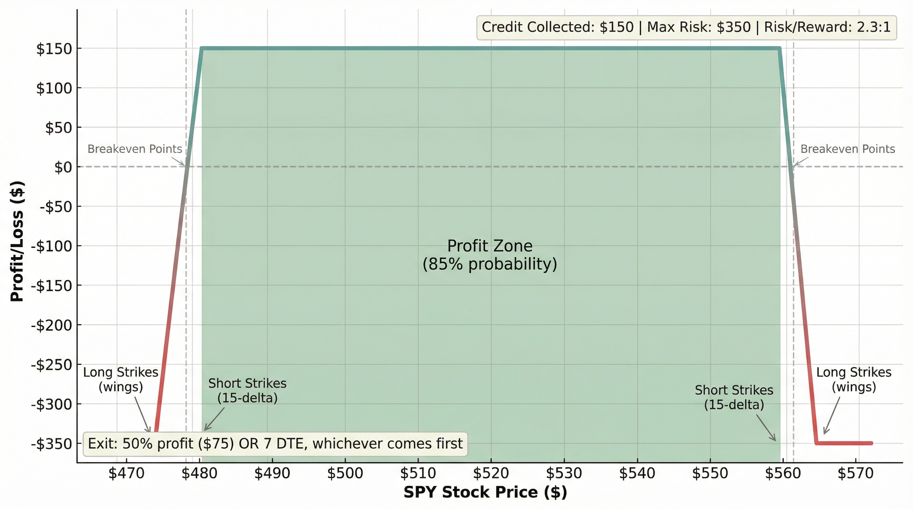
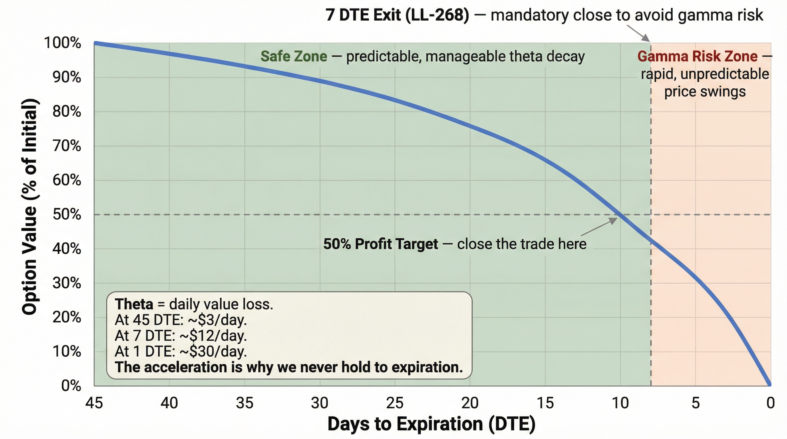
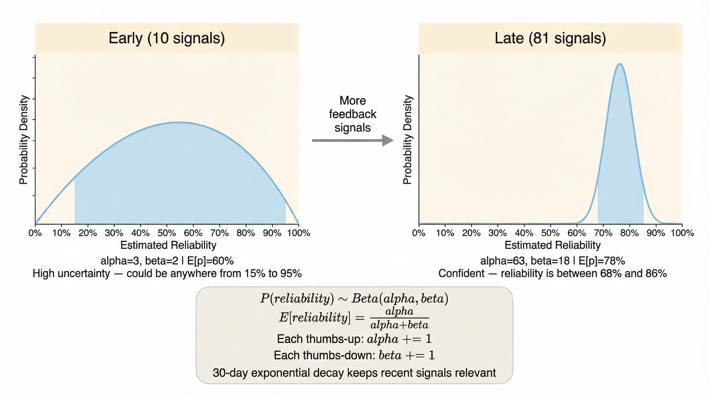
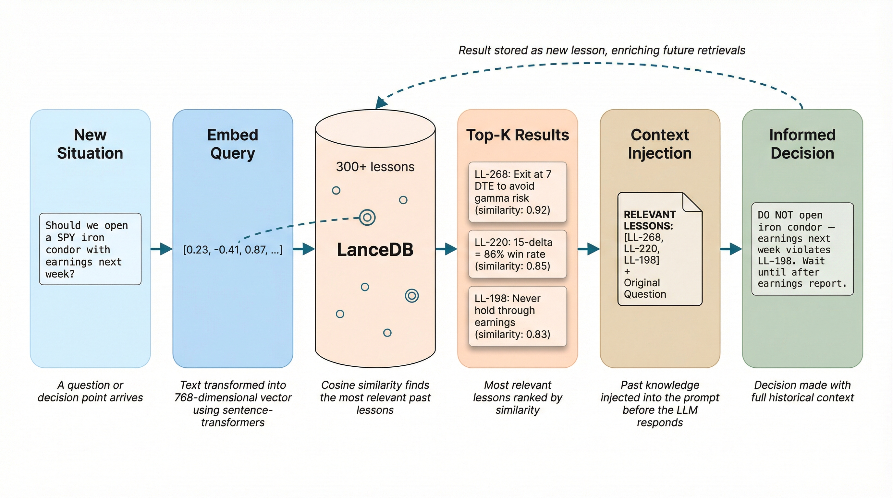

# AI Trading System

[](https://github.com/IgorGanapolsky/trading/actions/workflows/ci.yml)
[](https://github.com/IgorGanapolsky/trading/actions/workflows/ralph-loop-ai.yml)
[](https://github.com/IgorGanapolsky/trading/actions/workflows/self-healing-monitor.yml)
[](https://igorganapolsky.github.io/trading/lessons/)
[](pyproject.toml)
[](LICENSE)
[](https://igorganapolsky.github.io/trading/)

Autonomous AI trading system with multi-model routing via [Tetrate Agent Router Service (TARS)](https://router.tetrate.ai), self-healing CI, continuous learning from failures, and a defined-risk SPY iron condor strategy.

> **North Star**: $6K/month after-tax options income, as fast as safely possible (no fixed date).
>
> **Accounts**: Alpaca Paper ($100K) validates strategy + Alpaca live brokerage opportunistically mirrors qualified setups behind strict risk gates.
>
> **Strategy**: SPY-first iron condors (15-20 delta, $10-wide wings, up to 8 open option legs, typically ~2 concurrent condors). The risk layer uses an index/ETF whitelist that can expand (broker support permitting); current production trading targets SPY options.
>
> **Status**: [System State](https://github.com/IgorGanapolsky/trading/blob/main/data/system_state.json) | [Progress Dashboard](https://github.com/IgorGanapolsky/trading/wiki/Progress-Dashboard) | [GitHub Pages](https://igorganapolsky.github.io/trading/) | [Judge Demo Evidence](https://igorganapolsky.github.io/trading/lessons/judge-demo.html) | [RAG Query](https://igorganapolsky.github.io/trading/rag-query/)

---

## System Overview


*End-to-end architecture: data ingestion, AI decision engine, autonomous execution, safety compliance, and transparent reporting*

---

## Architecture

### CI/CD Pipeline (30+ Automated Gates)


*Every code change passes through 30+ automated quality, security, testing, and trading-specific gates*

### LLM Gateway & TARS Integration


*Multi-model routing via TARS with budget-aware fallback to OpenRouter and Anthropic Direct*

The system routes all LLM calls through a unified gateway (`src/utils/llm_gateway.py`) that supports [Tetrate Agent Router Service (TARS)](https://router.tetrate.ai) as the primary provider, with OpenRouter and direct Anthropic as fallbacks.

| Env Var | Purpose |
|---|---|
| `LLM_GATEWAY_BASE_URL` | TARS endpoint (e.g. `https://api.router.tetrate.ai/v1`) |
| `LLM_GATEWAY_API_KEY` / `TETRATE_API_KEY` | TARS authentication |
| `OPENROUTER_API_KEY` | OpenRouter fallback for cost-optimized models |

**Budget-Aware Model Selection** (`src/utils/model_selector.py`) implements the BATS framework — routing tasks to the cheapest model that can handle the complexity:

| Task Complexity | Model | Cost (per 1M tokens) | Provider |
|---|---|---|---|
| Simple (parsing, classification) | DeepSeek V3 | $0.30 / $1.20 | TARS or OpenRouter |
| Medium (analysis, signals) | Mistral Medium 3 | $0.40 / $2.00 | TARS or OpenRouter |
| Complex (risk, strategy) | Kimi K2 | $0.39 / $1.90 | TARS or OpenRouter |
| Reasoning (pre-trade research) | DeepSeek-R1 | $0.70 / $2.50 | TARS or OpenRouter |
| Critical (trade execution) | Claude Opus | $15 / $75 | Anthropic Direct |

Safety guarantee: trade execution **always** uses Opus regardless of budget. Fallback chain: Opus -> Kimi K2 -> Mistral -> DeepSeek.

**Autonomous Pre-Trade Reliability Controls** (`src/llm/trade_opinion.py`)
- **Uncertainty-adaptive consensus**: when confidence is near the boundary (or risk flags exist), the system can run multiple independent samples and aggregate by majority vote + agreement score.
- **Sampled strong-judge audit**: optional quality/risk judge runs on a sampled subset of opinions and can enforce conservative overrides.

Key env vars:
| Env Var | Purpose |
|---|---|
| `TRADE_OPINION_CONSENSUS_ENABLED` | Enable uncertainty-triggered multi-sample consensus (`true`/`false`) |
| `TRADE_OPINION_MAX_SAMPLES` | Max samples per opinion when consensus is triggered (default `3`) |
| `TRADE_OPINION_UNCERTAIN_BAND` | Confidence band around 0.5 to trigger extra sampling (default `0.15`) |
| `TRADE_OPINION_JUDGE_ENABLED` | Enable sampled judge pipeline (`true`/`false`, default `false`) |
| `TRADE_OPINION_JUDGE_SAMPLE_RATE` | Fraction of opinions to judge (`0.0`-`1.0`) |
| `TRADE_OPINION_JUDGE_ENFORCE` | If judge rejects, force conservative `should_trade=false` |
| `TRADE_OPINION_JUDGE_LOG_PATH` | JSONL evidence log path for judge outcomes |

### Feedback-Driven Context Pipeline


*Continuous learning: Signal Capture -> Thompson Sampling -> Memory Storage -> Context Injection*

- **LanceDB vector store** — Semantic search over 170+ lessons learned (`rag_knowledge/lessons_learned/`)
- **Thompson Sampling** — Beta-Bernoulli model per task category with 30-day exponential decay
- **MemAlign** — Distills feedback into principles; syncs to ShieldCortex persistent memory
- **Context injection** — Weak categories and past failures injected into every session start

### Trading Pipeline


*6-stage execution with safety gates at every step and a closed learning loop*

### Ralph Mode (Autonomous CI)

Ralph is the self-healing loop that keeps the system operational:

- **88 GitHub Actions workflows** — trading execution, position management, monitoring, learning
- **Self-Healing Monitor** — runs every 15 minutes during market hours, auto-fixes issues
- **Ralph Loop** — overnight autonomous coding sessions (design-first, atomic tasks, validation gates)
- **Auto-published blog** — lessons and reports publish to GitHub Pages and Dev.to automatically

### Key Components

| Component | Purpose | Location |
|---|---|---|
| **LLM Gateway** | TARS/OpenRouter/Anthropic routing | `src/utils/llm_gateway.py` |
| **Model Selector** | Budget-aware BATS framework | `src/utils/model_selector.py` |
| **Orchestrator** | Main trading logic | `src/orchestrator/main.py` |
| **Thompson Sampler** | Strategy selection | `src/ml/trade_confidence.py` |
| **Trade Memory** | SQLite trade journal | `src/learning/trade_memory.py` |
| **Risk Manager** | Position sizing, stops | `src/risk/` |
| **RAG Index** | LanceDB semantic search | `scripts/build_rag_query_index.py` |
| **RLHF Pipeline** | Feedback capture + learning | `.claude/rules/rlhf-feedback.md` |
| **Autonomous Trader** | End-to-end execution | `scripts/autonomous_trader.py` |

---

## Strategy: SPY-First Iron Condors

```
Sell 15-20 delta put spread + 15-20 delta call spread
$10-wide wings, 30-45 DTE
Exit: 50% profit OR 7 DTE | Stop: 100% of credit
Max risk: $5,000 per position (5% of $100K), max 8 open option legs (~2 concurrent condors)
```

**Why iron condors**: Defined risk on both sides, ~85% probability of profit at 15-delta, theta decay works daily, profits in sideways markets. Phil Town Rule #1 (don't lose money) enforced at every level.

### Iron Condor Payoff Profile


*Defined risk on both sides: $150 credit collected, $350 max risk, 85% probability profit zone*

### Theta Decay & Exit Rules


*Time decay accelerates exponentially — 50% profit target at 20-25 DTE, mandatory exit at 7 DTE*

### Thompson Sampling Learning


*Bayesian reliability estimation: uncertainty narrows from 15-95% CI to 68-86% CI as signals accumulate*

### RAG Knowledge Retrieval


*6-stage retrieval: embed query → semantic search → top-K results → context injection → informed decision*

---

## Quick Start

Runtime requirement: **Python >=3.11,<3.12** (CPython 3.11.x).

```bash
git clone https://github.com/IgorGanapolsky/trading.git
cd trading
python3 -m venv venv && source venv/bin/activate
pip install -r requirements.txt
cp .env.example .env  # Configure API keys (see .env.example for full list)
```

```bash
python3 scripts/autonomous_trader.py     # Paper trading
python3 scripts/sync_alpaca_state.py     # Sync broker state
python3 scripts/system_health_check.py   # Health check
pytest tests/ -q                         # Run tests
ruff check src/                          # Lint
```

---

## Risk Management

| Safeguard | Rule |
|---|---|
| **Position Limits** | Max 5% per position ($5,000) |
| **Stop-Loss** | 100% of credit received, no exceptions |
| **Exit** | 50% profit OR 7 DTE, whichever first |
| **Max Positions** | 8 open option legs (typically ~2 iron condors) |
| **Paper First** | 90-day validation before live capital |

---

## For AI Agents & LLMs

This repo is optimized for AI agent collaboration:

- System rules: `.claude/CLAUDE.md`
- Mandatory rules: `.claude/rules/MANDATORY_RULES.md`
- RAG knowledge base: `rag_knowledge/`
- RLHF feedback: `.claude/memory/feedback/`
- Agent terminal toolkit: `scripts/agent_workflow_toolkit.py`
- Toolkit usage: `python3 scripts/agent_workflow_toolkit.py --help`
- LLM manifest (summary): `https://igorganapolsky.github.io/trading/llms.txt`
- LLM manifest (full catalog): `https://igorganapolsky.github.io/trading/llms-full.txt`
- Auto-refresh workflow: `.github/workflows/refresh-llms-manifests.yml`

Quick bootstrap:

```bash
python3 scripts/agent_workflow_toolkit.py zsh-snippet   # x/p/s/funked helpers
python3 scripts/agent_workflow_toolkit.py slim-logs --in artifacts/devloop/continuous.log
python3 scripts/agent_workflow_toolkit.py bundle README.md src/utils/llm_gateway.py --out artifacts/devloop/context_bundle.md
```

---

## Disclaimer

**This software is for educational purposes only.** Trading involves significant risk of loss. Past performance does not guarantee future results. Always paper trade before using real money. This is NOT financial advice.

---

**Built with** Python, [Alpaca](https://alpaca.markets), [TARS](https://router.tetrate.ai), [OpenRouter](https://openrouter.ai), [LanceDB](https://lancedb.com), [PaperBanana](https://github.com/llmsresearch/paperbanana), and GitHub Actions

**Maintained by** [Igor Ganapolsky](https://github.com/IgorGanapolsky)
