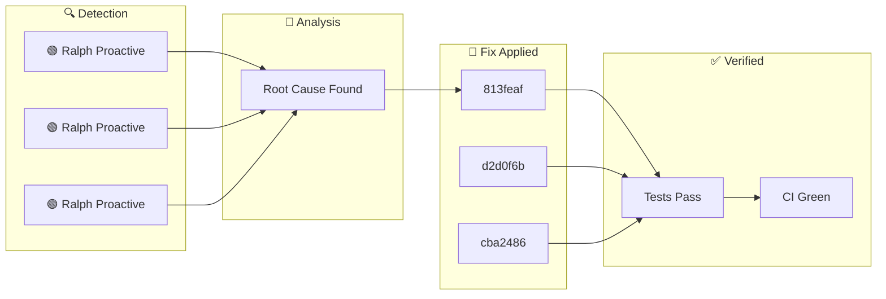

**Saturday, January 31, 2026** (Eastern Time)

> Building an autonomous AI trading system means things break. Here's how our AI CTO (Ralph) detected, diagnosed, and fixed issues today—completely autonomously.

## 🗺️ Today's Fix Flow

## 📊 Today's Metrics

| Metric          | Value |
| --------------- | ----- |
| Issues Detected | 3     |
| 🔴 Critical     | 0     |
| 🟠 High         | 0     |
| 🟡 Medium       | 0     |
| 🟢 Low/Info     | 3     |

---

## ℹ️ INFO Ralph Proactive Scan Findings

### 🚨 What Went Wrong

- Dead code detected: true

### ✅ How We Fixed It

Applied targeted fix based on root cause analysis.

### 📈 Impact

Risk reduced and system resilience improved.

---

## ℹ️ INFO Ralph Proactive Scan Findings

### 🚨 What Went Wrong

- Dead code detected: true

### ✅ How We Fixed It

Applied targeted fix based on root cause analysis.

### 📈 Impact

Risk reduced and system resilience improved.

---

## ℹ️ INFO Ralph Proactive Scan Findings

### 🚨 What Went Wrong

- Dead code detected: true

### ✅ How We Fixed It

Applied targeted fix based on root cause analysis.

### 📈 Impact

Risk reduced and system resilience improved.

---

## 🚀 Code Changes

These commits shipped today ([view on GitHub](https://github.com/IgorGanapolsky/trading/commits/main)):

| Severity | Commit                                                                | Description                                   |
| -------- | --------------------------------------------------------------------- | --------------------------------------------- |
| ℹ️ INFO  | [813feaf0](https://github.com/IgorGanapolsky/trading/commit/813feaf0) | docs(ralph): Auto-publish discovery blog post |
| ℹ️ INFO  | [d2d0f6b1](https://github.com/IgorGanapolsky/trading/commit/d2d0f6b1) | docs(blog): Ralph discovery - docs(ralph): Au |
| ℹ️ INFO  | [cba24860](https://github.com/IgorGanapolsky/trading/commit/cba24860) | docs(ralph): Auto-publish discovery blog post |
| ℹ️ INFO  | [a5585d3b](https://github.com/IgorGanapolsky/trading/commit/a5585d3b) | chore(ralph): Record proactive scan findings  |
| ℹ️ INFO  | [8e9c69d1](https://github.com/IgorGanapolsky/trading/commit/8e9c69d1) | chore(ralph): Update workflow health dashboar |

## 🎯 Key Takeaways

1. **Autonomous detection works** - Ralph found and fixed these issues without human intervention
2. **Self-healing systems compound** - Each fix makes the system smarter
3. **Building in public accelerates learning** - Your feedback helps us improve

---

## 🤖 About Ralph Mode

Ralph is our AI CTO that autonomously maintains this trading system. It:

- Monitors for issues 24/7
- Runs tests and fixes failures
- Learns from mistakes via RAG + RLHF
- Documents everything for transparency

_This is part of our journey building an AI-powered iron condor trading system targeting $6K/month financial independence._

**Resources:**

- 📊 [Source Code](https://github.com/IgorGanapolsky/trading)
- 📈 [Strategy Guide](https://igorganapolsky.github.io/trading/2026/01/21/iron-condors-ai-trading-complete-guide.html)
- 🤫 [The Silent 74 Days](https://igorganapolsky.github.io/trading/2026/01/07/the-silent-74-days.html) - How we built a system that did nothing

---

_💬 Found this useful? Star the repo or drop a comment!_