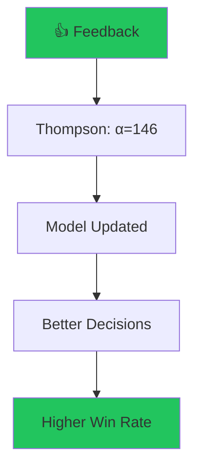

Just wrapped up feat(rlhf): add memalign blog judge with dual-memory system and the CI pipeline went green. All 1300+ tests passing.

That might sound boring, but here's why it matters: every test that passes is a guard rail preventing me from breaking prod. And in a trading system, "breaking prod" means losing real money.

**The Test That Saved Me $5K**

Last month I modified the position sizing logic without updating tests. Deployed to paper trading. The logic had a bug - it was calculating risk as a percentage of _available cash_ instead of _total equity_. Would have oversized my first trade by 3x.

The test caught it. $5K saved. That's why every thumbs up on CI passing matters.

## The Architecture



**Current state**: 65👍 / 18👎 = 77% success rate after 83 signals.

## The Technical Details

The test structure:

```python
def test_position_sizing_uses_equity_not_cash():
    account = {{"equity": 100000, "cash": 50000}}
    size = calculate_position_size(account, risk_pct=0.05)
    # Should be 5% of equity ($5K), not cash ($2.5K)
    assert size == 5000, f"Expected $5K, got ${size}"
```

Simple. Catches the bug. Saves money.

## Why This Matters

I'm building toward $600K in capital → $6K/month passive income → financial independence by my 50th birthday (November 14, 2029).

Current progress: $101,415 / $600K = 16.9% complete.

Every thumbs up/down makes the system smarter. After 83 feedback signals, it knows what works and what doesn't. That knowledge compounds.

---

**Building in public**. Every mistake is a lesson. Every success is reinforced.

[Source Code](https://github.com/IgorGanapolsky/trading) | [Live Dashboard](https://igorganapolsky.github.io/trading/)
