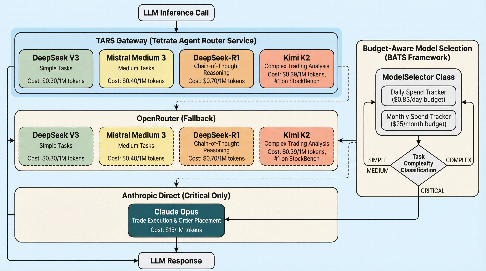
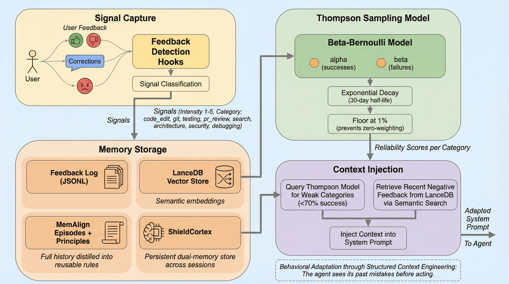
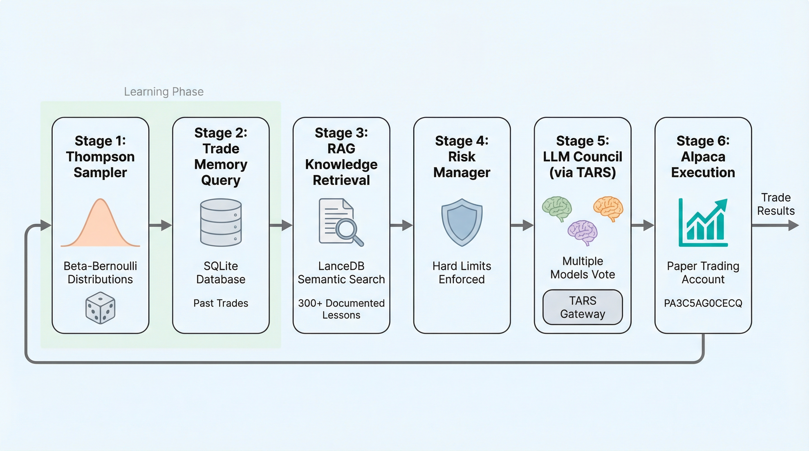

## The Problem

Every README needs architecture diagrams. But creating them manually in Lucidchart, draw.io, or Figma takes 30-60 minutes per diagram. For a fast-moving project with 84 workflows and 5 LLM providers, diagrams go stale before the ink dries.

We needed diagrams that are:
- Generated from text descriptions (version-controllable)
- Publication quality (not ASCII art)
- Reproducible (re-run when architecture changes)
- Fast (minutes, not hours)

## PaperBanana

[PaperBanana](https://github.com/llmsresearch/paperbanana) is an open-source implementation of Google Research's automated academic illustration system. It uses a 5-agent pipeline:

1. **Retriever** — finds relevant reference diagrams for style guidance
2. **Planner** — converts text description into a detailed visual specification
3. **Stylist** — enforces academic aesthetic standards (colors, typography, spacing)
4. **Visualizer** — renders the image using Gemini 3 Pro Image Preview
5. **Critic** — evaluates the result and triggers automatic refinement if needed

The critic is the key differentiator. It reviews the generated image against the source description and flags issues like missing connections, wrong colors, or layout problems. The pipeline then re-generates with corrections.

## What We Generated

Three diagrams, all from plain text `.txt` files, generated in parallel in under 5 minutes total:

### 1. LLM Gateway Architecture


**Input**: A text description of our TARS -> OpenRouter -> Anthropic fallback chain with the BATS budget-aware model selector.

**Critic feedback after iteration 1**: "Arrows from Task Complexity diamond should connect to corresponding models in both TARS and OpenRouter layers." Auto-refined in iteration 2.

### 2. Feedback-Driven Context Pipeline


**Input**: Description of our Thompson Sampling + LanceDB + MemAlign feedback loop.

**Critic verdict after iteration 1**: "No issues found. Image is publication-ready." Done in 1 iteration.

### 3. Trading Pipeline


**Input**: 6-stage iron condor execution pipeline with safety gates.

**Critic feedback**: Caught a duplicate Stage 4 box and incorrect arrow colors. Fixed in iteration 2.

## Claude Code Skills

We built three slash commands so diagrams are always one command away:

```
/generate-diagram "LLM gateway routing through TARS"
/generate-plot data/stats.json --intent "Cost per model comparison"
/update-diagrams                  # Regenerate all from source .txt files
```

Source descriptions live in `docs/assets/diagram_*.txt` — version-controlled, diffable, and reproducible. When the architecture changes, edit the `.txt` file and run `/update-diagrams`.

## Setup

```bash
# Only requirement: GEMINI_API_KEY in .env and uvx installed
echo "GEMINI_API_KEY=your-key" >> .env
uvx paperbanana generate --input description.txt --caption "My Diagram" --output diagram.png
```

No `pip install` needed — `uvx` handles the virtual environment automatically.

## Cost

Three diagrams used approximately:
- ~25K Gemini tokens total (planning + styling + critique)
- 5 Gemini Imagen calls (3 first iterations + 2 refinements)
- Total cost: ~$0.02

Compare to 2 hours of manual diagram work.

---

*Diagrams generated for the [Tetrate AI Buildathon](https://tetrate.ai/buildathon/apply). Source code and skills at [github.com/IgorGanapolsky/trading](https://github.com/IgorGanapolsky/trading).*
