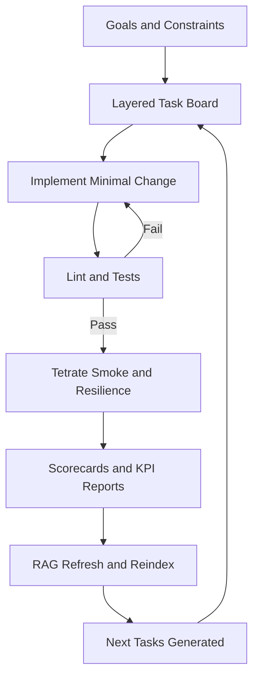

# Hackathon System Explainer

Last Updated (UTC): 2026-02-16T14:46:47Z

## Current Runtime Snapshot
- Latest cycle: `n/a`
- Latest profile: `n/a`
- Latest loop status timestamp: `n/a`
- Latest Tetrate latency: `1637 ms`
- Latest Tetrate estimated call cost: `0.00004500`

## Proof Checklist
- [x] Devloop status present
- [x] Profit readiness scorecard present
- [x] KPI priority report present
- [x] Tetrate smoke metrics present
- [x] Tetrate smoke response present
- [ ] Trade opinion smoke actionable

## How It Works (Simple)
1. The system writes a task list.
2. It builds one task at a time.
3. It runs tests and smoke checks.
4. It stores evidence and learns from results.
5. It repeats until no high-value tasks remain.

## How It Works (Technical)
1. Signal collection and model routing produce candidate decisions.
2. Reliability checks validate output structure and failure handling.
3. KPI and readiness artifacts quantify latency, cost, and quality.
4. Knowledge updates improve future retrieval and decision context.
5. Governance checks keep delivery quality consistently high.

## System Flow Diagram

## Demo Artifacts
- `artifacts/tars/submission_summary.md`
- `artifacts/tars/judge_demo_checklist.md`
- `artifacts/tars/smoke_metrics.txt`
- `artifacts/tars/trade_opinion_smoke.json`
- `artifacts/devloop/profit_readiness_scorecard.md`
- `artifacts/devloop/kpi_priority_report.md`

## Live Tasks and Timing
The section below is auto-generated each cycle from the active Layer-1 task board and runtime logs.

- Generated (UTC): `2026-02-16T14:46:36Z`
- Open Layer-1 tasks: `2`

## Active Tasks (with elapsed time)
- `ACTIVE` Add expectancy metrics (profit factor, avg winner, avg loser) to `scripts/generate_profit_readiness_scorecard.py`. (elapsed: 27m 21s)
- `ACTIVE` Add a promotion gate artifact that blocks strategy promotion when win rate/run-rate thresholds are below target. (elapsed: 27m 21s)

## Current Task In Progress
- Task: Add expectancy metrics (profit factor, avg winner, avg loser) to `scripts/generate_profit_readiness_scorecard.py`.
- Started (UTC): `2026-02-16T14:19:15Z`
- Elapsed: `27m 21s`

## Runtime Phases
- Last analyze: cycle=5 profile=profit duration=17s
- Last TARS: cycle=3 duration=1m 27s
- Last RAG: cycle=4 duration=23s

## Newly Added Tasks This Run
- None

## Sources
- `manual_layer1_tasks.md`
- `artifacts/devloop/continuous.log`

