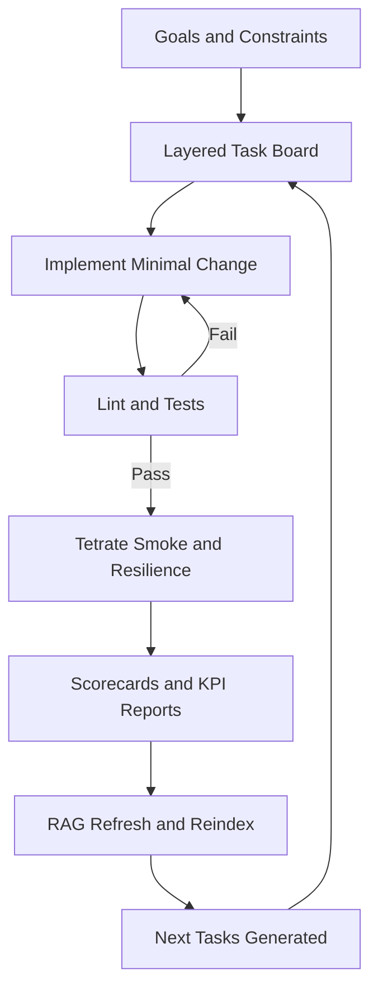

# Hackathon System Explainer

Last Updated (UTC): 2026-02-16T07:58:38Z

## Current Runtime Snapshot
- Latest cycle: `n/a`
- Latest profile: `n/a`
- Latest loop status timestamp: `n/a`
- Latest Tetrate latency: `897 ms`
- Latest Tetrate estimated call cost: `n/a`

## Proof Checklist
- [x] Devloop status present
- [x] Profit readiness scorecard present
- [x] KPI priority report present
- [x] Tetrate smoke metrics present
- [x] Tetrate smoke response present
- [ ] Trade opinion smoke actionable

## How It Works (Simple)
1. The system writes a task list.
2. It builds one task at a time.
3. It runs tests and smoke checks.
4. It stores evidence and learns from results.
5. It repeats until no high-value tasks remain.

## How It Works (Technical)
1. `scripts/continuous_devloop.sh` runs loop cycles.
2. `scripts/layered_tdd_loop.sh` handles layered TDD analyze/execute.
3. `scripts/tars_autopilot.sh` creates Tetrate evidence artifacts.
4. `scripts/devloop_commit_and_report.sh` snapshots progress and checks PR.
5. `scripts/rag_refresh_and_report.sh` refreshes retrieval memory.

## System Flow Diagram

## Demo Artifacts
- `artifacts/tars/submission_summary.md`
- `artifacts/tars/judge_demo_checklist.md`
- `artifacts/tars/smoke_metrics.txt`
- `artifacts/tars/trade_opinion_smoke.json`
- `artifacts/devloop/profit_readiness_scorecard.md`
- `artifacts/devloop/kpi_priority_report.md`

