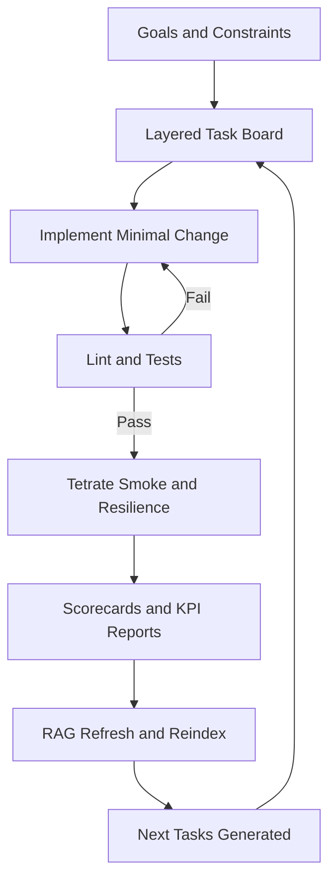
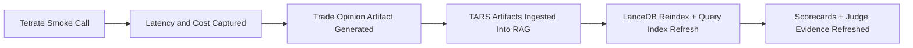
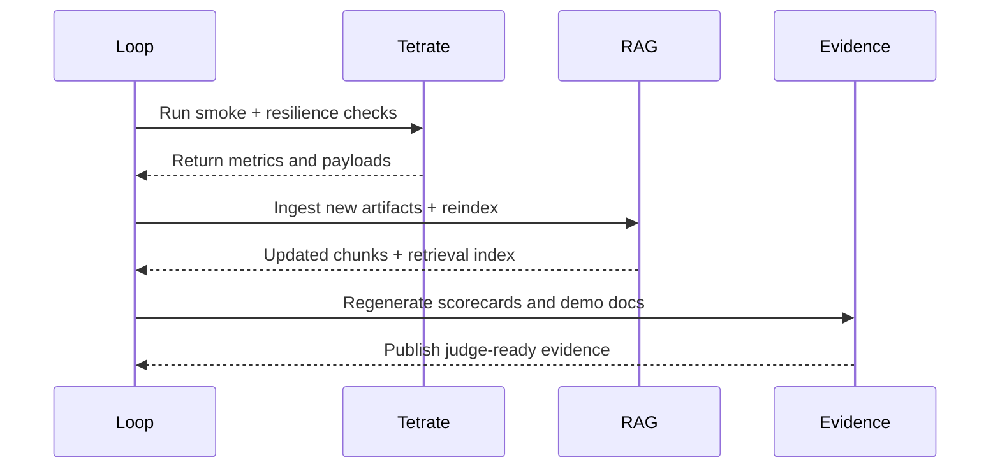

# Hackathon System Explainer

Last Updated (UTC): 2026-02-28T11:03:01Z

## Current Runtime Snapshot
- Latest cycle: `n/a`
- Latest profile: `n/a`
- Latest loop status timestamp: `n/a`
- Latest Tetrate latency: `984 ms`
- Latest Tetrate estimated call cost: `0.00001650`

## Proof Checklist
- [x] Devloop status present
- [x] Profit readiness scorecard present
- [x] KPI priority report present
- [x] Tetrate smoke metrics present
- [x] Tetrate smoke response present
- [x] Trade opinion smoke actionable

## How It Works (Simple)
1. The system writes a task list.
2. It builds one task at a time.
3. It runs tests and smoke checks.
4. It stores evidence and learns from results.
5. It repeats until no high-value tasks remain.

## How It Works (Technical)
1. Signal collection and model routing produce candidate decisions.
2. Reliability checks validate output structure and failure handling.
3. KPI and readiness artifacts quantify latency, cost, and quality.
4. Knowledge updates improve future retrieval and decision context.
5. Governance checks keep delivery quality consistently high.

## System Flow Diagram

## What Happened So Far
The diagram below explains what we have already completed in this build cycle.

## Delivery Timeline

## Demo Artifacts
- `artifacts/tars/submission_summary.md`
- `artifacts/tars/judge_demo_checklist.md`
- `artifacts/tars/smoke_metrics.txt`
- `artifacts/tars/trade_opinion_smoke.json`
- `artifacts/devloop/profit_readiness_scorecard.md`
- `artifacts/devloop/kpi_priority_report.md`

